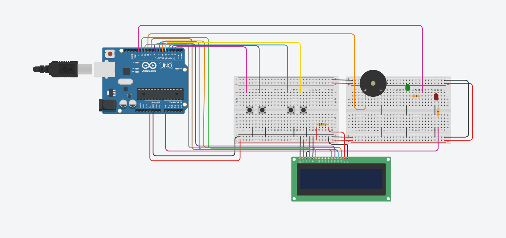

# CCP020 - DIGITAL EXPERIENCE ULTIMATE

## Reprodutor de Músicas com Arduino

Esse projeto foi desenvolvido utilizando um Arduino Uno junto com alguns componentes eletrônicos básicos para criar um pequeno reprodutor de músicas.

O sistema possui:
- Display LCD 16x2
- Buzzer
- LEDs
- Botões
- Menu de navegação

Com isso, o usuário consegue escolher músicas pelo LCD e controlar tudo utilizando os botões do circuito.

---

# Integrantes

- Kaike Frentzel De Oliveira
- Pedro Henrique Cembrone De Sá

---

# Sobre o funcionamento

Quando o sistema é ligado, aparece no display um menu com as músicas disponíveis.

Exemplo:

```text
Escolher musica:
> Mario
```

Utilizando os botões, é possível trocar de música, iniciar a reprodução, pausar e parar quando quiser.

O LED verde indica quando a música está tocando e o LED vermelho indica quando o sistema está parado ou pausado.

---

# Botões do sistema

| Botão | Função |
|---|---|
| CIMA | Próxima música |
| BAIXO | Música anterior |
| PLAY | Tocar ou pausar |
| STOP | Parar música |

---

# Músicas disponíveis

As músicas adicionadas no projeto foram:

- Mario
- Harry Potter
- Star Wars
- Darth Vader
- Pac-Man
- Tetris
- Zelda
- Sonic

---

# Componentes utilizados

| Componente | Quantidade |
|---|---|
| Arduino Uno | 1 |
| Display LCD 16x2 | 1 |
| Protoboard | 2 |
| Buzzer | 1 |
| LEDs | 2 |
| Resistores | 3 |
| Botões | 4 |
| Jumpers | Vários |

---

# Como as músicas funcionam

As músicas foram feitas utilizando vetores com notas e tempos.

Exemplo:

```cpp
static int n[] = {659,659,0,659};
static int d[] = {150,150,100,150};
```

O vetor `n[]` guarda as frequências das notas e o `d[]` guarda o tempo de duração de cada uma.

Quando aparece `0`, significa uma pausa na música.

---

# Organização do código

O código foi separado em funções para facilitar a organização e deixar mais fácil de entender.

Algumas das principais funções utilizadas foram:

| Função | O que faz |
|---|---|
| `mostrar_menu()` | Mostra o menu no LCD |
| `ler_botoes()` | Faz a leitura dos botões |
| `iniciar_musica()` | Inicia a música |
| `rodar_pausa()` | Pausa ou continua a reprodução |
| `parar_tudo()` | Para a música |
| `tocar_som()` | Reproduz as notas |
| `buscar_dados()` | Carrega os dados das músicas |

---

# Ligações utilizadas

## LCD

| LCD | Arduino |
|---|---|
| RS | Pino 12 |
| E | Pino 11 |
| D4 | Pino 9 |
| D5 | Pino 8 |
| D6 | Pino 7 |
| D7 | Pino 6 |

---

## Botões

| Botão | Pino |
|---|---|
| CIMA | Pino 2 |
| BAIXO | Pino 3 |
| PLAY | Pino 4 |
| STOP | Pino 5 |

---

## Saídas

| Componente | Pino |
|---|---|
| Buzzer | Pino 10 |
| LED Verde | Pino 13 |
| LED Vermelho | Pino A0 |

---

# O que foi utilizado no projeto

Durante o desenvolvimento do projeto foram utilizados conceitos como:

- Variáveis
- Vetores
- Funções
- Estruturas condicionais
- Repetição
- Ponteiros
- Máquina de estados
- Biblioteca LiquidCrystal

---

# Como executar
1. Montar o circuito
2. Abrir o código na IDE Arduino  
3. Conectar o Arduino Uno no computador
4. Fazer o upload do código 
5. Utilizar os botões para controlar as músicas  


---

# Resultado final

No final, o projeto conseguiu funcionar da forma esperada, reproduzindo músicas através do buzzer e permitindo o controle pelo LCD e pelos botões.

Além da parte funcional, o projeto ajudou bastante na prática de programação, organização do código e integração entre hardware e software.

---

# Imagem do Projeto



---

# Vídeo do Projeto

Vídeo mostrando o funcionamento do projeto:

[Assistir vídeo no YouTube](https://youtube.com/shorts/e8fbsYHyTJE?si=T8x5NMm9kxQhim_A)

---
